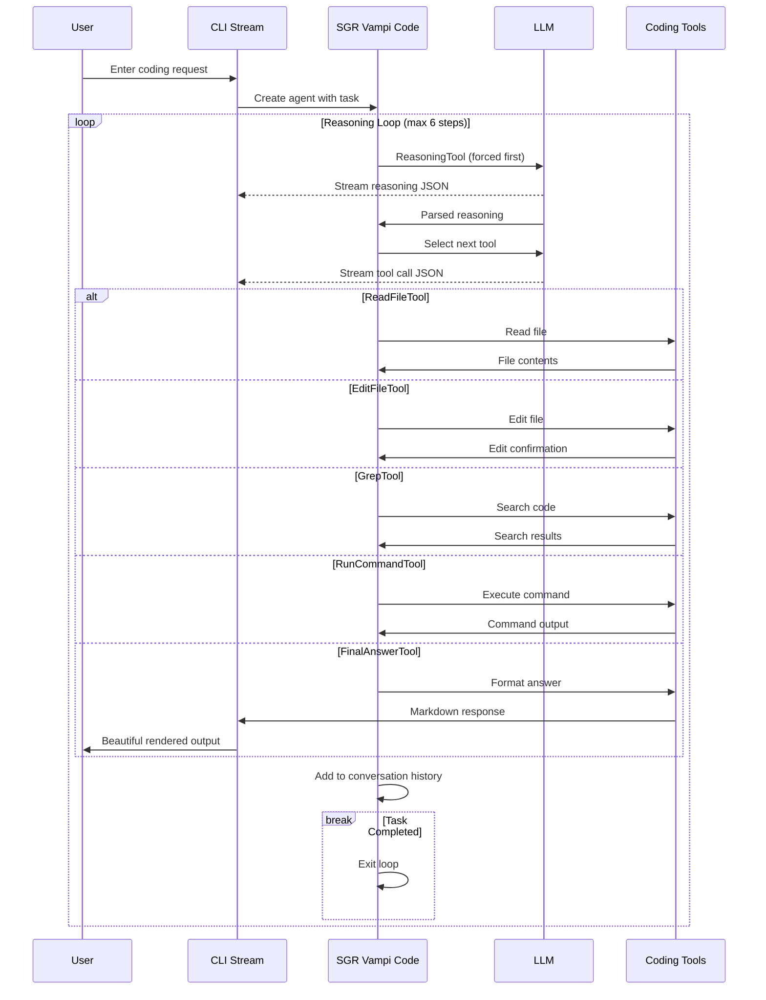

# 🦇 SGR Vampi Code - AI Coding Assistant with Schema-Guided Reasoning

demo of reseach code cli agent 

https://github.com/user-attachments/assets/8afd8caa-f084-4606-8ae0-b95f367a3c92


## SGR Vampi Code is an intelligent coding assistant powered by Schema-Guided Reasoning (SGR). It can run with small LLMs for fully local development assistance.

This project is developed by the **neuraldeep** community. It is inspired by the Schema-Guided Reasoning (SGR) work and [SGR Agent Demo](https://abdullin.com/schema-guided-reasoning/demo) delivered by "LLM Under the Hood" community and AI R&D Hub of [TIMETOACT GROUP Österreich](https://www.timetoact-group.at)

If you have any questions - feel free to reach out to [Valerii Kovalskii](https://www.linkedin.com/in/vakovalskii/).

**AI Coding Assistant with Streaming JSON and Beautiful Markdown Rendering**

Production-ready open-source coding assistant using Schema-Guided Reasoning (SGR). Features real-time streaming responses, beautiful terminal UI with Markdown rendering, and comprehensive code manipulation capabilities.

## ✨ Key Features

- 🧠 **Schema-Guided Reasoning** - Structured thinking for reliable code operations
- 📝 **Code Analysis & Manipulation** - Read, write, edit, and search through your codebase
- 🎨 **Beautiful Terminal UI** - Rich formatting with Markdown rendering for responses
- 🔄 **Streaming JSON Output** - Real-time tool execution with syntax highlighting
- 💬 **Continuous Dialogue** - Multi-turn conversations with context preservation
- 🌐 **Multi-language Support** - Responds in the same language as your request
- 🚀 **Local-First** - Works with small LLMs for fully offline development

## 🚀 Quick Start

### Prerequisites

First, install UV (modern Python package manager):

```bash
# Install UV
curl -LsSf https://astral.sh/uv/install.sh | sh
# or on Windows:
# powershell -ExecutionPolicy ByPass -c "irm https://astral.sh/uv/install.ps1 | iex"
```

### Installation & Setup

```bash
# 1. Clone the repository
git clone https://github.com/vamplabAI/sgr-vampi-code.git
cd sgr-vampi-code

# 2. Setup configuration
cp config.yaml.example config.yaml
# Edit config.yaml with your API settings

# 3. Install dependencies
uv sync

# 4. Run the interactive chat
uv run cli_stream.py chat
```

## 🎮 Usage

### Interactive Chat Mode

Start a continuous conversation with the coding assistant:

```bash
uv run cli_stream.py chat

# With custom typing speed
uv run cli_stream.py chat --speed 0.005  # Slower
uv run cli_stream.py chat --speed 0      # Instant

# With debug logging
uv run cli_stream.py chat --debug

# Work on a specific project directory
uv run cli_stream.py chat --workspace /path/to/project
uv run cli_stream.py chat -w ../other-project
```

### Single Task Mode

Execute a single coding task:

```bash
uv run cli_stream.py task "Analyze the project structure and list all Python files"

# Work on a different directory
uv run cli_stream.py task "Find all TODO comments" --workspace ~/my-project
```

### Fast Mode (No Typing Effect)

Get instant responses without the typing animation:

```bash
uv run cli_stream.py fast "Create a new utility function for file parsing"

# With custom workspace
uv run cli_stream.py fast "Refactor main.py" -w /path/to/project
```

### Workspace Parameter

The `--workspace` (or `-w`) parameter allows you to specify which directory the agent should work in. This is useful when:
- Running the agent from a different location than your project
- Working on multiple projects without changing directories
- Accessing projects in parent or sibling directories

```bash
# Relative path (from current directory)
uv run cli_stream.py chat --workspace ../sgr-deep-research

# Absolute path
uv run cli_stream.py chat --workspace /home/user/projects/my-app

# Current directory (default)
uv run cli_stream.py chat --workspace .
```

All file operations (read, write, edit, grep, list, find) will be relative to the specified workspace directory.

## 🛠️ Available Tools

The SGR Vampi Code agent has access to powerful tools for code manipulation:

### File Operations
- **ReadFileTool** - Read and analyze existing code files
- **WriteFileTool** - Create new files or overwrite existing ones
- **EditFileTool** - Make surgical edits to existing files (preferred for modifications)

### Code Search & Discovery
- **GrepTool** - Search for patterns across the codebase
- **ListDirectoryTool** - Explore project structure and organization
- **FindFilesTool** - Locate files by name patterns

### Execution
- **RunCommandTool** - Execute shell commands (build, test, lint, etc.)

### Reasoning & Planning
- **ReasoningTool** - Think through problems step-by-step
- **ClarificationTool** - Ask clarifying questions when needed
- **FinalAnswerTool** - Provide comprehensive answers in beautiful Markdown format

## 💡 Example Tasks

The coding assistant excels at various development scenarios:

### Code Analysis
```
"Analyze the current project structure and explain the architecture"
"Find all TODO comments in Python files"
"Show me how the authentication system works"
```

### Code Creation
```
"Create a new utility module for data validation with Pydantic"
"Add a new API endpoint for user registration"
"Implement a caching decorator for expensive functions"
```

### Code Modification
```
"Refactor the database connection code to use connection pooling"
"Add error handling to all API endpoints"
"Update the logging configuration to use structured logging"
```

### Debugging & Fixes
```
"Fix the import errors in the main module"
"Find and fix potential SQL injection vulnerabilities"
"Optimize the slow database queries in the user service"
```

## 🎨 Beautiful Markdown Responses

All final answers are automatically formatted in Markdown with:

- **Headers** for clear structure
- **Bold** and *italic* for emphasis
- `Code blocks` with syntax highlighting
- Lists for enumeration
- Tables for structured data
- Quotes for important notes
- Links for references

Example output:

```markdown
## Analysis Complete

I've analyzed the project structure. Here's what I found:

### Project Architecture

The project follows a **modular architecture** with clear separation of concerns:

1. **Core Module** (`sgr_deep_research/core/`)
   - `agents/` - Agent implementations
   - `tools/` - Tool definitions
   - `models.py` - Data models

2. **API Layer** (`sgr_deep_research/api/`)
   - FastAPI endpoints
   - Request/response models

### Key Findings

- ✅ Well-organized code structure
- ✅ Type hints throughout
- ⚠️ Some files missing docstrings
```

## ⚙️ Configuration

### Setup Configuration File

1. **Create config.yaml from template:**

```bash
cp config.yaml.example config.yaml
```

2. **Configure API settings:**

```yaml
# OpenAI API Configuration
openai:
  api_key: "your-api-key-here"        # Your API key
  base_url: "https://api.openai.com/v1"  # Or your local LLM endpoint
  model: "gpt-4o-mini"                # Model to use
  max_tokens: 8000                    # Maximum tokens
  temperature: 0.4                    # Generation temperature (0.0-1.0)
  proxy: ""                           # Optional proxy

# Execution Settings
execution:
  max_steps: 6                        # Maximum reasoning steps
  logs_dir: "logs"                    # Log directory
```

### CLI Commands

Inside the interactive chat, you can use these commands:

- `/exit`, `/quit`, `/q` - Exit the chat
- `/clear`, `/cls` - Clear the screen
- `/help`, `/h` - Show help information

## 🧠 Schema-Guided Reasoning for Coding

### Why SGR for Coding Tasks?

Traditional ReAct agents struggle with complex coding tasks on smaller models because they need to decide:
1. **What** to do next
2. **When** to use tools
3. **How** to structure the solution

SGR solves this by forcing structured reasoning first, then executing deterministically:

```python
# Phase 1: Structured Reasoning (always happens)
reasoning = model.generate(format="json_schema")
# {
#   "reasoning_steps": ["Read the file", "Identify the issue", "Plan the fix"],
#   "current_situation": "Found import error in main.py",
#   "remaining_steps": ["Fix the import", "Verify the change"]
# }

# Phase 2: Tool Selection & Execution (deterministic)
tool = select_tool_from_reasoning(reasoning)
result = execute_tool(tool)
```

### Coding Workflow

The agent follows a structured workflow:

1. **Understand** - Analyze the task and current codebase state
2. **Plan** - Break down complex changes into steps
3. **Execute** - Make changes incrementally with verification
4. **Verify** - Check that changes work as expected
5. **Report** - Provide clear summary in Markdown format

## 📊 Agent Architecture



## 🎯 Best Practices

### When Using the Coding Assistant

1. **Be Specific** - Clear requests get better results
   - ✅ "Add error handling to the login function in auth.py"
   - ❌ "Fix the code"

2. **Provide Context** - Help the agent understand your needs
   - ✅ "Refactor the database code to use async/await for better performance"
   - ❌ "Make it faster"

3. **Iterative Approach** - Break large tasks into steps
   - ✅ "First, analyze the authentication flow. Then suggest improvements."
   - ❌ "Rewrite the entire authentication system"

4. **Verify Changes** - Always review what the agent modified
   - The agent will show you exactly what changed
   - Use git diff to see the full picture

## 👥 Open-Source Development Team

This project is built by the community with pure enthusiasm as an open-source initiative:

- **SGR Concept Creator**: [@abdullin](https://t.me/llm_under_hood) - Original Schema-Guided Reasoning concept
- **Project Coordinator & Vision**: [@VaKovaLskii](https://t.me/neuraldeep) - Team coordination and project direction
- **Lead Core Developer**: [@virrius](https://t.me/virrius_tech) - Complete system rewrite and core implementation
- **Vampi Code Adaptation**: Community effort to adapt SGR for coding tasks

*All development is driven by pure enthusiasm and open-source community collaboration. We welcome contributors of all skill levels!*

## 🤝 Contributing

We welcome contributions from the community! Here's how you can help:

### How to Contribute

1. **Fork the repository**
2. **Create a feature branch**
   ```bash
   git checkout -b feature/your-feature-name
   ```
3. **Make your changes**
4. **Test thoroughly**
   ```bash
   uv sync
   uv run cli_stream.py chat
   # Test your changes
   ```
5. **Submit a pull request**

### Areas for Contribution

- 🛠️ **New coding tools** (linters, formatters, test runners)
- 🎨 **UI improvements** for the terminal interface
- 📝 **Better prompts** for specific programming languages
- 🔧 **IDE integrations** (VSCode, JetBrains, etc.)
- 🌐 **Language support** for more programming languages
- 📊 **Benchmarking** coding task performance

## 📝 License

This project is open-source and available under the MIT License.

## 🖥️ API Server

The SGR Vampi Code API server is required for running benchmarks. It exposes the agent as an OpenAI-compatible API endpoint.

### Starting the API Server

**Important:** Run all commands from the **project root directory** (not from inside `sgr_deep_research`).

```bash
# 1. Make sure you have config.yaml in the project root
cp config.yaml.example config.yaml
# Edit config.yaml with your API settings

# 2. Install dependencies (if not already done)
uv sync

# 3. Start the API server on port 8010
uv run python -m sgr_deep_research --port 8010
```

The server will start at `http://localhost:8010`.

### Using Docker

Alternatively, you can run the server using Docker:

```bash
cd services
docker-compose up -d
```

### API Endpoints

- `GET /health` - Health check endpoint
- `POST /v1/chat/completions` - OpenAI-compatible chat completions (streaming supported)

## 🤖 Available Models (Benchmark)

The model benchmark module supports the following LLM providers and models:

### OpenRouter Models

| Alias | Model ID | Display Name | Input $/1M | Output $/1M |
|-------|----------|--------------|------------|-------------|
| `claude-opus-4.5` | `anthropic/claude-opus-4.5` | Claude Opus 4.5 | $15.00 | $75.00 |
| `claude-sonnet-4.5` | `anthropic/claude-sonnet-4.5` | Claude Sonnet 4.5 | $3.00 | $15.00 |
| `gpt-5.1` | `openai/gpt-5.1` | GPT-5.1 | $2.50 | $10.00 |
| `gemini-3-pro` | `google/gemini-3-pro-preview` | Gemini 3n | $1.25 | $10.00 |
| `glm-4.6` | `z-ai/glm-4.6` | GLM 4.6 | $0.30 | $0.90 |
| `grok-4.1-fast` | `x-ai/grok-4.1-fast` | Grok 4.1 Fast | $0.20 | $0.50 |

### Cerebras Models

| Alias | Model ID | Display Name | Input $/1M | Output $/1M |
|-------|----------|--------------|------------|-------------|
| `cerebras-glm-4.6` | `zai-glm-4.6` | GLM 4.6 (Cerebras) | Free | Free |

### Usage

```bash
# List all available models
python -m benchmark.model_benchmark.run_model_benchmark --list-models

# Run with specific models
python -m benchmark.model_benchmark.run_model_benchmark --tasks-dir ./tasks --models claude-sonnet-4.5 gpt-5.1

# Run with all models
python -m benchmark.model_benchmark.run_model_benchmark --tasks-dir ./tasks
```

### Required Environment Variables

- `OPENROUTER_API_KEY` - For OpenRouter models
- `CEREBRAS_API_KEY` - For Cerebras models

## 🔗 Related Projects

- [SGR Deep Research](https://github.com/vamplabAI/sgr-deep-research) - Research agent using SGR
- [SGR Agent Demo](https://abdullin.com/schema-guided-reasoning/demo) - Original SGR concept demo

---

🦇 **Happy Coding with SGR Vampi Code!**

*Intelligent coding assistance powered by Schema-Guided Reasoning*
